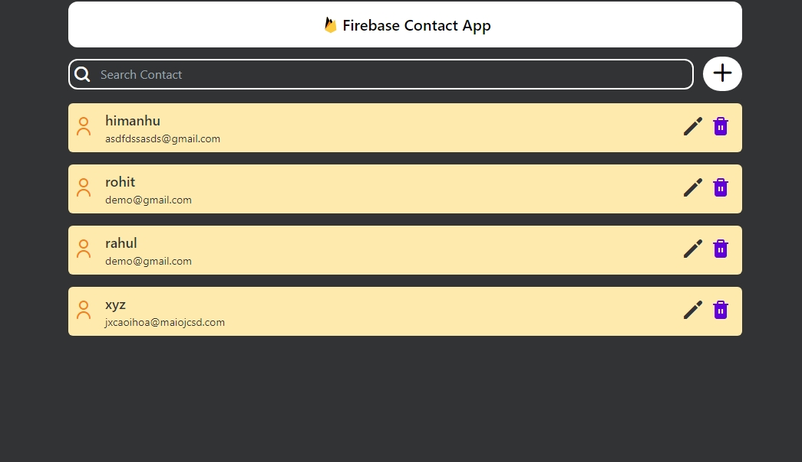

# Firebase CRUD App

This is a simple CRUD (Create, Read, Update, Delete) application built using Firebase for the backend and React with Tailwind CSS for the frontend.

## Screenshots

## Overview

This application allows users to perform CRUD operations on a collection of data stored in Firebase Firestore. Users can add new items, view existing items, update item details, and delete items from the collection.

# Link
https://contact-app-ashen.vercel.app/

## Features

- Create: Users can add new items to the collection by providing relevant details.
- Read: Users can view a list of existing items with their details.
- Update: Users can edit the details of existing items.
- Delete: Users can delete items from the collection.
- Responsive Design: The application is responsive, providing a seamless experience across various devices and screen sizes.
- Interactive Features: Interactive elements enhance user experience, making the application intuitive and easy to use.

## Technologies Used

- Firebase Firestore: For storing and managing data.
- React: For building the frontend user interface.
- Tailwind CSS: For styling the UI with utility-first CSS classes.

## Getting Started

1. Clone the repository.

   git clone https://github.com/himanshusharma2007/Contact-App.git

2. Install dependencies.

   cd <project_folder>
   npm install

3. Configure Firebase credentials in the project.
   - Create a Firebase project on the Firebase Console.
   - Obtain your Firebase configuration details.
   - Add the configuration details to your project (e.g., in a `.env` file).
4. Run the application locally.

   npm start

## Contributing

Contributions are welcome! Feel free to open issues or submit pull requests to contribute to this project.
